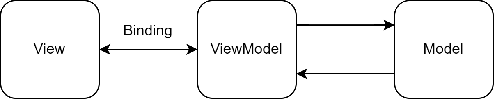

## MVVM嫌いの憂鬱（WPF/WinUI3）

GUIアプリケーションで、割と標準的なアーキテクチャパターンとして、MVVMがある。

**Model-View-ViewModel**という訳だ。

これ

 

 

理屈は分かる。

**Model**と**View**と**ViewModel**の各々の役割を明確にする、疎結合にする。

そうすることで、テストが容易になる、コードが再利用できる、メンテナンスしやすくなる。

メリットは分かる。

 

しかし、実アプリに適応しようとすると、途端に上手くいかなくなる。

MVVMは理想をのたまうだけで、実装の指針を与えてくれるわけではない。

「MVVMの理屈は分かるが、嫌い」

MVVMを知ったのは10年以上前だが、第一印象はそんな感じ。

考え方に慣れていけば、徐々に良くなるだろうと考えていたが、結局その印象は変わらず、大嫌いなままだ。

今日は、どうして私がMVVMを嫌いなのか、つらつらと書いていこうと思う。

## MVVMの語順がおかしい

GUIの文脈では、まずModelから設計する人はいない（たぶん）。

まずはViewをデザインして、中間層となるViewModelを考えつつ、Modelを設計するという順番だろう（たぶん）。

思考の流れはView-ViewModel-Modelだから、**VVMM**とするべきだ。

**Model**と**View**は最も離れているはずなのに、Model-View-ViewModelとなる理由をだれか教えてほしい（MVCのCがVMに変わっただけかもしれないが・・・）。

もう一つ愚痴を並べると、ModelというのはViewとViewModel以外のコードである。特に意味がない言葉であるにも関わらず、一番先頭に来ているのはおかしい。

## ViewModelが意味不明

設計において言葉は極めて重要で、言葉が全てと言っても過言ではない。

### Viewは見た目（Presentation）

Windowとか各種コントロールの配置とか、色とかフォントとか。

これは分かる。

### Modelはアプリのコアロジック

実際の機能を担当する。

これもなんとなく分かる。

### で、ViewModelって何？

**ViewModel**から何か理解できる人はいるのだろうか？

**ViewとModelの間にあるという立場**を表しているだけで、役割・目的は表していない。

AWSのセキュリティグループくらい意味不明。

メジャーな言葉を2つつなげて、無限の可能性を持つ意味不明な言葉を作り上げてる。

 

ViewとModelの仲立ちでViewModelならば、BridgeでもConnectorでも何でも良いのではないだろうか。

**ViewModel**がどのような機能を持つのか、どこから**View**でどこから**ViewModel**の仕事なのか、どこから**ViewModel**でどこから**Model**なのか。

機能の線引きは極めて重要なのにも関わらず、**ViewModel**という言葉は何も教えてくれない。

## 知らない問題

「ViewはViewModelを知っているが、ViewModelはViewを知らない」

「ViewModelはModelを知っているが、ModelはViewModelを知らない」

という文章を時々見る。

 

**知らないわけがない。**

 

知らなかったらコンポーネントとして機能しないし、そもそも**View**と**ViewModel**間のバインディングでは双方向に「知っている」。

つながりが明確で、限定的で、Contractに従っている。つまり疎結合になっているということだ。

「知らない」というわけではない。

## 複雑性が増す

例えば、`TextBox`に"1"を入力して、`バイバインButton`を押して、`TextBlock`に"2"を表示するプログラムを考える。
1. `View:TextBox`に`ViewModel:Number`をバインディング
2. `View:バイバインButton`に`ViewModel:バイバインCommand`をバインディング
3. `ViewModel:バイバインCommand`を実装。`ViewModel:Number`から`ViewModel:Result`を計算する。
4. `View:TextBlock`を`ViewModel:Result`にバイバインディング

という手順を踏む。

ところが、MVVMでなければ、

`V:Button.Click { V:TextBlock = V:TextBox * 2; }` 

これだけで済む。

4バイン複雑化というデメリットに相当するメリットはあるのか？

いやない。

 

Hello worldをMVVMで書く人はいない。

が、ある程度複雑なアプリをXAML+コードビハインドだけで書く人もいない。

ここでMVVMの問題が一つ。

どこでMVVMを適応するべきかの指針がないということだ。

## ViewModelからViewの処理

MVVMを始めると、開始3分で頭から壁に激突する。

そう、`MessageBox`だ。

これは、**実アプリではViewModelからView、もしくはModelからViewModel/Viewという、逆方向の呼び出しが必要になるにもかかわらず、MVVMでは標準で用意されていない**ことが原因だ。

解決策は、Messengerパターン、Serviceパターン、Behaviorパターンがある。

Messengerパターンは割と分かりやすいが、Serviceパターンで覚束なくなり、Behaviorパターンは私の頭では理解不能だ。

1つ機能を追加するのに、2つ複雑性が増しているような感じ。

staticクラスの`MessageBox.Show()`じゃいかんのか、という気がしてくる。

## ファイルが散逸する

これは運用次第だが、Modelsフォルダ、ViewModelsフォルダ、Viewsフォルダでファイルを管理する場合がある。

疎結合というお題目だが、実際のコーディングではPage1.xamlとPage1ViewModel.csとロジックを永遠に行き来する。

フォルダ間の無限移動が発生するので、ViewModelsフォルダとViewsフォルダは統合して、View毎に管理したほうが良い。

## 結局

MVVMの理念は分かる。メリットも分かる。

が、言葉が意味不明だし、ネットではチンプンカンプンな説明が溢れているし、実装すると確実に複雑性が増すし、メリットに見合わないデメリットも多い。

ということで、ずっと心に積もっていたMVVMへの愚痴を書き出してみた。

 

で、「他人の愚痴を並べるばかりで、何も建設的なことをしない」とよく言われるので、

MVVMを基に、自分なりの改善策を考えてみた。

[Presentation-State Model](Presentation-State Model (WinUI)) へ続く。
